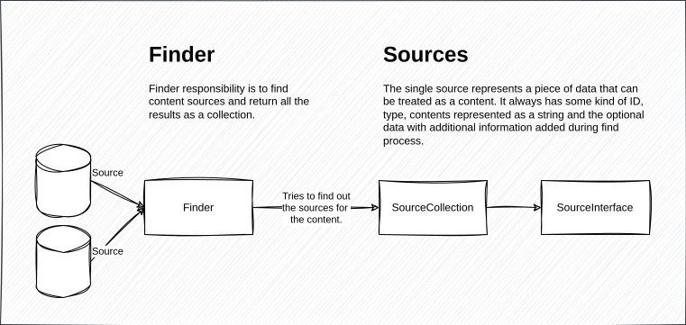

# External Content

This module provides functionality to fetch content from external sources (
local), process them and then pass it to plugins to do whatever you want with
it.

## Workflow

### Step #1: Find

### Step #2: Identify & Bundle

### Step #3: Covert to HTML

### Step #4: Parse HTML

### Step #5: Load
