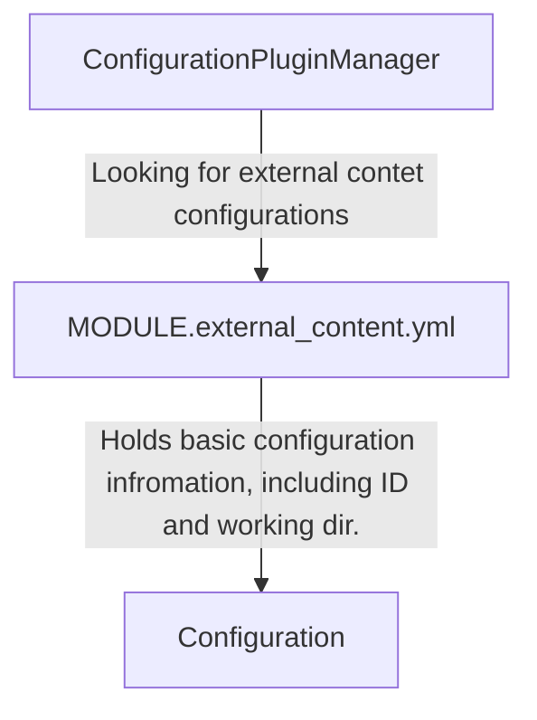
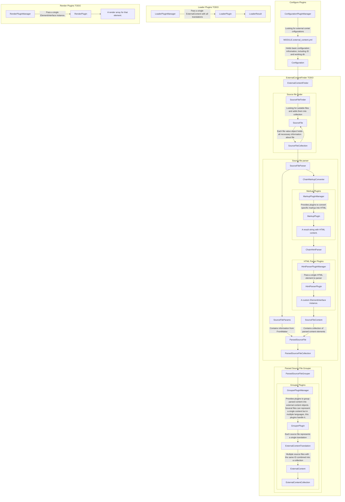

# External Content

This module provides functionality to fetch content from external sources (local), process them and then pass it to plugins to do whatever you want with it.

## Glossary

- **Configuration Plugin**: An external content configuration. Provided by
  via `*.external_content.yml` files.
- **Source File**: A representation of source file with a content. Holds
  information about working directory and it's URI where it found.
- **Markup Plugin**: Before processing content it should be converted to
  HTML markup and these plugins are responsible for that. E.g. Markdown
  plugin should convert Markdown into HTML.
- **HTML parser Plugin**: These plugins parse HTML into custom
  `ElementInterface` PHP DTO objects which is more lightweight and can be
  customized for specific elements and project needs.
- **Source File Content**: A collection of parsed `ElementInterface`
  elements using HTML parser plugins. Think of it like DOM Document.
- **Source File Params**: A simple DTO object with values from Front Matter
  of a source file.
- **Parsed Source File**: Contains information parsed from Source File. It
  will contain info about Source File, Source File Content and Source File
  Params.
- **Grouper Plugin**: Grouper plugin is responsible for grouping multiple
  versions of the same content at the single External Content.
- (TODO) **External Content**: The DTO object contains information about
  specific content and its External Content Translations.
- (TODO) **Loader Plugin**: Loader plugin is responsible for saving External
  Content into Drupal.
- (TODO) **Render Plugin**: Render plugin is responsible for rendering
  Source File Content into HTML markup.

## Plugin System

### Configuration Plugins

These plugins are represented as `*.external_content.yml` files inside any
module. This file contains configurations for external content pipelines.

Example:

```yaml
# mymodule.external_content.yml
test:
  label: Testing
  working_dir: 'public://external-content'
```

In example above we defined `test` external content configuration with label
«Testing» and `working_dir` — which directs where to look for content. For
more information check `\Drupal\external_content\Plugin\ExternalContent
\Configuration\Configuration`.

Configuration plugins is a starting point for all external content.



### Grouper Plugins

These plugins responsible for grouping multiple parsed source content files into
a single external content with multiple translations.

## Workflow

This is a basic representation of workflow. They are not strictly tied so
loader and can be called not at the same process as finders.


