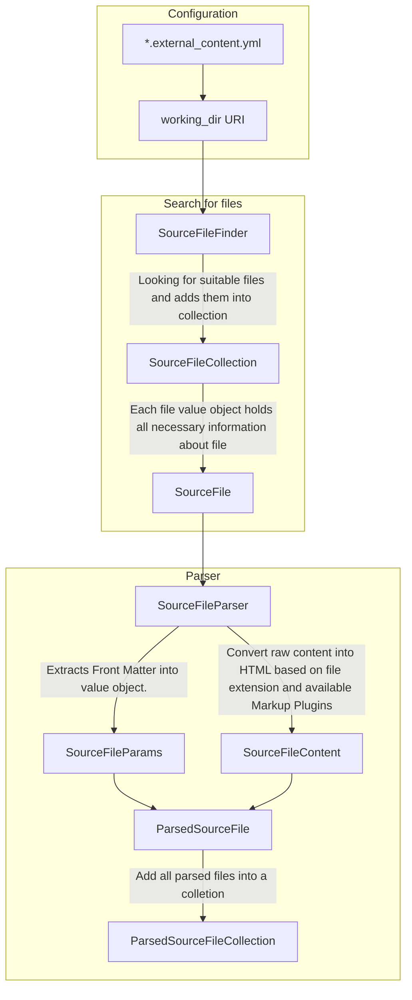

# External Content

This module provides functionality to fetch content from external sources (local), process them and then pass it to plugins to do whatever you want with it.

Flow:

```mermaid
graph TB
  subgraph Configuration
    A1[*.external_content.yml] --> B1[working_dir URI]
  end
  subgraph Search for files
    B1 --> SourceFileFinder
    SourceFileFinder -->|Looking for suitable files and adds them into collection| SourceFileCollection
    SourceFileCollection -->|Each file value object holds all necessary information about file| SourceFile
  end
  subgraph Parser
    SourceFile --> SourceFileParser
    SourceFileParser --> |Extracts Front Matter into value object.| SourceFileParams
    SourceFileParser --> |Convert raw content into HTML based on file extension and available Markup Plugins| SourceFileContent
    SourceFileParams --> ParsedSourceFile
    SourceFileContent --> ParsedSourceFile
    ParsedSourceFile --> |Add all parsed files into a colletion| ParsedSourceFileCollection
  end
```
